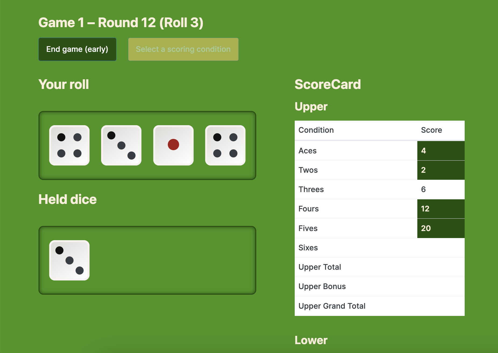

# yahtzee-just-the-game

## What

Yahtzee, just the game. Simplified copy of [**this project**](https://github.com/niamh-d/codeop-feature-ext-yahtzee) without backend, log in, sign up or authentication.

Gameplay history is saved to local storage.

Uses React, React Router, Pico CSS.

Based off original project by: Maria Rinaldi (GH: [@MaryRinaldi](https://github.com/MaryRinaldi)) – [link to repo](https://github.com/MaryRinaldi/Yahtzee_Dicee).

## Rules

[Rules PDF](https://www.hasbro.com/common/instruct/yahtzee.pdf)

## Design

### Scoreboard and dice boxes



## Running

### Start frontend dev server

1. In a terminal run:

```
npm run dev
```

Don't kill it; let it run.

## Installation steps (on first run)

### Install frontend packages

1. In the terminal run:

```
npm i
```
